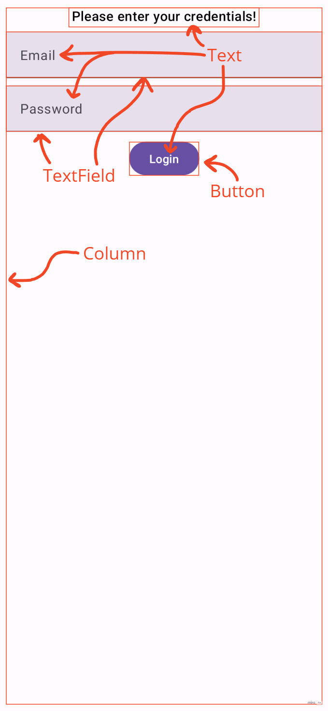

# Labor 02 IMSC - Jetpackkel az égbe ☁ 🚀 ✨

***Szerző: Püspök-Kiss Balázs***

## Bevezető

Az IMSC feladat célja, hogy bemutasson egy megoldást, ami a legmodernebb eszközöket alkalmazza a
fejlesztés során. A motiváció a laborok átdolgozása mögött az, hogy szerintem a jelenlegi laborok
többnyire elavult technológiákat használnak, amik egy kötelező rossz az ipar számára. A régi
technológiák támogatása szükséges, azonban mindig érdemes a jövőre figyelni, ott bővíteni a
jelenlegi tudását az embernek.

A dokumentáció segítségével egy olyan alkalmazást hozol létre, amit követendő példának ítélek meg. A
megoldás során szó fog esni ajánlott eszközökről, amik jelentősen megkönnyítették számomra a
fejlesztést, valamint nagyon hasznosnak ítélem meg őket és használatuk segíthet majd a házi feladat
megírásában is.

## Feladat előtti megjegyzés

Ez a feladat sok bónusz infót tartalmaz, aminek a használata a való életben nagyon kívánt, azonban
valószínűleg nem lesz számonkérve. A legjobb tudásom ellenére is azt kérem, hogy keressétek fel
gyakran a [Jetpack Compose] dokumentációját a hivatalos oldalán, sokkal több mindenről esik szó ott,
amire nekem nincs időm kitérni. Stackoverflow is hasznos olykor, keresni a Google-ön egyet, ha
rögtön nem működik valami.

## Setup ⚙

A kezdő projekt a `PublicTransport.zip` fájlba van becsomagolva (ha bevan valahova csomagolva).
Egy projekt setup-olása és felkonfigurálása fontos, de nem a világot szeretném megváltani, úgyhogy
annak az elmagyarázása majd egy másik napra marad. Mindenesetre megjegyzek néhány dolgot. *Át lehet
ugrani idő hiányában a Setup részt, de a sigma grind nem állhat meg, érdekes dolgokról van szó.*

*A `PublicTransport` starter projekt teljesen angol!*

### Erősen ajánlott pluginek

Mindenekelőtt ajánlanék néhány linter plugint, amikkel toppon lehet tartani a kód minőségét:

* [Detekt] - A root mappában található `detekt-config.yml` fájllal fel lehet konfigurálni, egy
linter, ami figyelmeztet adott formai dolgokra.
* [ktlint] - van egy unofficial pluginja JetBrains Marketplacen, ami telepítehető Android Studio-ra
is, hasznos a built-in formatterje.
* [SonarLint] - nagyon sok mindenre beszól a kódodnál, jó szokás halgatni rá.


### 4 darab Activity

Lennie kellene 4 darab Activity fájlnak a projektben:

* `LoginActivity.kt`
* `ListActivity.kt`
* `DetailsActivity.kt`
* `PassActivity.kt`

Minden (kivéve 1) itteni Activity a [ComponentActivity]-ből származik le, ez a
default [Jetpack Compose]-nál, nem kell meglepődni. Ennek egyik leszármazottja
az [AppCompatActivity], amit gyakrabban használnak XML-es Activity-knél. Mindkettő az
alap [Activity]-ből származik le.

A `DetailsActivity` az [AppCompatActivity]-ből származik le, ami fontos szerepet fog játszani mikor
a dátumokat válasszuk ki a rendelni kívánt jegyhez.

### Manifest és Theme

Mindegyik Activity fel van véve az `AndroidManifest.xml` fájlba. Fontos az, hogy az Activity-khez
rendelt Theme az egy olyan theme legyen, ami leszármazottja egy AppCompat Theme-nek (ilyen a
Material3 Theme is). Ez szintén ahhoz kell, hogy a `DetailsActivity`-ben meg tudjuk jeleníteni a
[DateRangePicker]-t. Egyébként **nem sikerülne betölteni** a [DateRangePicker]-t, crashelne az app.

### Resources

**Import-tal nem kell foglalkozni**, minden be van rakva a `res` mappába. Nagy szokás adott
Stringeket beégetni a kódba, szerintem undorítóbb dolog nincs e kerek Földön. Igényes emberek
vagyunk, késsel-villával eszünk, `strings.xml`-ből nyerjük ki a szükséges szöveget, stb..
Windows-on ***ALT+ENTER***, egyébként jobb klikk a raw String-re és rá kell nyomni
az `Extract string resource` menüre. Ekkor feljön egy dialog, hogy milyen kulccsal lehessen elérni
azt és automatikusan hozzáadja a szöveged a `strings.xml` fájlhoz, valamint refactorlálja a kódod a
legjobb tudása alapján az Android Studio (általában wrappeli így:
`stringResource(R.strings.my_string))`). Én úgy szoktam, hogy beírom raw string-ként, majd ezzel az
módszerrel be is rakom `strings.xml`-be. Key-nél érdemes követni a `snake_case`-t.

### Project `build.gradle`

Itt van meghatározva a [Jetpack Compose] verziója, valamint a használt Kotlin verziója is. Nincs
nyulka-piszka, mert fura üzeneteket dobhat, hogy ez a dolog még nem volt tesztelve azzal a dologgal
és nem fog lebuildelni, csak ha beírsz egy lorem ipsum hosszú command line paramétert, vagy valami
más miatt átkoz meg. Néha vannak ilyenek, nem lehet mindig a cutting-edge dolgokat használni. Még
annyit megjegyzek, hogy itt definiálva van egy `compose_version` érték, ami a [Jetpack Compose]
könyvtárak verzióját hivatott jellemezni. A Compose compiler-rének általában más a verziója, ezt
kézzel át kell írni egy real project során.

### Module `build.gradle`

Néhány fontosabb dolog, ami itt van:

```groovy
android {
    // ...
    buildFeatures {
        compose true
    }
    composeOptions {
        kotlinCompilerExtensionVersion "1.3.0" // Ez nem (feltétlenül) a compose_version!
    }
    // ...
    compileOptions {
        // ...
        coreLibraryDesugaringEnabled true
    }
}

dependencies {
    // ...
    implementation 'androidx.compose.material3:material3:1.0.0-beta01'
    // ...
    coreLibraryDesugaring 'com.android.tools:desugar_jdk_libs:1.1.6'
}
```

`buildFeatures`-nél jelezni kell egy `compose true`-val, hogy Compose-t használunk. Compose compiler
verzióját kézileg be kell állítani, ideális, ha a `compose_version` <= `compose_compiler_version`.

Aztán van egy desugaring könyvtár, ami az új, modern dolgokat backportolja egy régebbi platformra,
hogy több készüléket tudjunk támogatni. Pl. van az [Instant] osztály, ami `API 26`-ban jött ki,
viszont ezzel a lib-bel lemehetünk legalább `API 23`-ig (ennyi a `minSdk` a projektnél).
Ha kikommentezzük a `coreLibraryDesugaringEnabled true` sort, akkor ordítani fog az Android Studio,
hogy nem csekkolod azt, hogy `API 26` vagy annál modernebb készüléket használsz e, mikor
[Instant]-ot használsz a `DetailsActivity`-ben. A feladat végén kikommentezheted, hogy lásd
(gradle sync-elni kell, aztán látod).

#### The more you know

Ha a groovy dependency-nél szeretnéd kiszervezni közös verziójú lib-ek verzióját, akkor azt
csakis `"`-val körbevett lib path esetén tudod megcsinálni egy `$` jellel a definiált verzió
előtt. `'`-val körbevett lib path esetén ez nem megy.

```groovy
dependencies {
    // ...
    // Ez a sor nincs benne a module build.gradle-ben, csak egy példa!
    def compose_version = "1.3.0-beta01"
    androidTestImplementation "androidx.compose.ui:ui-test-junit4:$compose_version"
    debugImplementation "androidx.compose.ui:ui-tooling:$compose_version"
    debugImplementation "androidx.compose.ui:ui-test-manifest:$compose_version"
    // ...
}
```

## Liftoff 🏖 🚀 ☁

4 Activity-t fogunk felépíteni egyesével, mindegyik valami egyedi feladatot lát el, amitől függni
fog a többi.

Röviden:

1. `LoginActivity`-nél `TextField`-et vizsgálunk, hogy beírt e a felhasználó valamit.
2. `ListActivity`-nél a kiválasztott listaelemtől függően különböző adatot továbbítunk a
`DetailActivity`-nek.
3. `DetailsActivity`-nél a `ListActivity` által küldött adatot dolgozzuk fel, valamint lehet
választani, milyen hosszú ideig és ki számára állítsunk ki egy béretet. Az ár dinamikusan változik
a napoktól függően. A napokat egy modern [DateRangePicker] által választhatjuk ki.
4. `PassActivity` megjeleníti az átvett adatok alapján a végső bérletet.

### Login

Vannak [Jetpack Compose]-nál elemek, amik leegyszerűsítik más, XML-es elemek használatát. Egyik
ilyen a `Column`. A `Column` a `LinearLayout`-ot hivatott leváltani, egész jól ráadásul. Mindent
meg lehet vele csinálni, amit az XML couterpart-ja tud, és kevés kóddal! [Compose Layouts]
oldal egész jól összeszedi a dolgokat.

Másik fontos dolog Compose-nál, az a `Modifier`. `Modifier`-ek lényeges adatot hordozhatnak arról,
hogyan is viselkedjen a UI elem.

* Töltse ki a számára adott helyet?
* Csak vízszintesen?
* Mennyi legyen az elem körül a padding?
* Milyen távolság legyen az elemeim között egy `Column`-nál?

Ez csak néhány példa a több százból, amire képes a `Modifier`. Általában egy elemhez át lehet
adni egy `Modifier`-t a `modifier` paraméterén keresztül.

Egyébként erről jut eszembe, van 
[ez a fantasztikus honlap][What is the euivalent of X in Jetpack Compose], ami megmondja adott
dolgoknak a Compose alternatíváját. Innen könnyebb lehet átírni a labort manuálisan, de inkább
használjátok a snippeteket, amiket adok nektek, ígérem, bőkezű leszek!

<!---
A lurkóknak, akik raw-ba nézik üzenem, hogy egy képet nem így szokás beilleszteni Markdown-ba,
viszont a center és resize miatt kénytelen voltam így megoldani. A helyes syntax egyébként
. img_path lehet url, relative vagy absolute path is (utóbbit nem
mindegyik parser támogatja).
--->
<p align="center">


</p>

A *`LoginScreen`* és layout-ja így nézne ki. Minden egyes Composable-re, mint a `Text`, `TextField`
és `Button` rá lehet keresni Google-ön, hogy hogyan működik pontosan, hogyan kell és érdemes őket
használni. Olyan sok mindent testre lehet szabni ezeknél az elemeknél, hogy el mehetne vele egy
egész labor, nem érnénk a végére ennek a három elemnek. Szerencsére open-source és [részletesen
dokumentált][Compose Layouts] minden, amit használtam, így könnyen utána lehet járni a dolgoknak.

#### Figyelem! ⚠

***Figyelni kell arra, hogy Material Design 3 elveket követtem a labor során, ez annyi különbséget
jelent, hogy pl. a `Button` az a [`androidx.compose.material3`][Androidx Compose Material 3]
könyvtárból származik, nem pedig a [`androidx.compose.material`][Androidx Compose Material]-ból.
Ha nem nézne ki úgy a UI, ahogy a képen, akkor változtasd meg a könyvtárat!***

A [`androidx.compose.material`][Androidx Compose Material] könyvtár is szükséges eleme a projektnek,
enélkül a Theme nem lehetne olyan amilyen és ez azt vonzza magával, hogy nem lehetne megnyitni a
[`DateRangePicker`][DateRangePicker]-t.

#### LoginScreen

```kotlin
// Annotation needed to use TextField, Button, etc.
@OptIn(ExperimentalMaterial3Api::class)
@Preview(showBackground = true)
@Composable
fun LoginScreen() {
    Column(
        modifier = Modifier
            .fillMaxSize()
            .padding(8.dp),
        // There is 8.dp space between items in the Column
        verticalArrangement = Arrangement.spacedBy(8.dp)
    ) {
        Text(
            text = stringResource(R.string.please_enter_your_credentials),
            textAlign = TextAlign.Center,
            modifier = Modifier.fillMaxWidth(),
            style = MaterialTheme.typography.titleMedium
        )

        val context = LocalContext.current

        var email by remember { mutableStateOf("") }
        var emailLabel by remember { mutableStateOf(context.getString(R.string.email_label)) }
        var wasEmailValidated by remember { mutableStateOf(false) }
        val isEmailWrong = email.isBlank() && wasEmailValidated
        TextField(
            value = email,
            onValueChange = {
                email = it
                emailLabel = context.getString(R.string.email_label)
            },
            // label accepts a Composable. Can be anything! The wonders, Compose is capable of 😊.
            label = {
                Row(
                    horizontalArrangement = Arrangement.spacedBy(8.dp),
                    verticalAlignment = Alignment.CenterVertically
                ) {
                    Text(emailLabel)
                    if (!isEmailWrong) {
                        Icon(
                            imageVector = Icons.Filled.Email,
                            contentDescription = stringResource(R.string.email_icon),
                            modifier = Modifier.size(16.dp)
                        )
                    }
                }
            },
            modifier = Modifier.fillMaxWidth(),
            keyboardOptions = KeyboardOptions(
                keyboardType = KeyboardType.Email
            ),
            singleLine = true,
            // Show error state, when statement is true
            isError = isEmailWrong
        )

        var password by remember { mutableStateOf("") }
        var passwordLabel by remember { mutableStateOf(context.getString(R.string.password_label)) }
        var wasPasswordValidated by remember { mutableStateOf(false) }
        val isPasswordWrong = password.isBlank() && wasPasswordValidated
        TextField(
            value = password,
            onValueChange = {
                password = it
                passwordLabel = context.getString(R.string.password_label)
            },
            label = { Text(passwordLabel) },
            modifier = Modifier.fillMaxWidth(),
            keyboardOptions = KeyboardOptions(
                keyboardType = KeyboardType.Password
            ),
            singleLine = true,
            isError = isPasswordWrong
        )

        Button(
            onClick = {
                // Validating text fields
                wasEmailValidated = true
                wasPasswordValidated = true
                val emailEmpty = email.isBlank()
                if (emailEmpty) {
                    emailLabel = context.getString(R.string.please_enter_your_email_address)
                }
                val passwordEmpty = password.isBlank()
                if (passwordEmpty) {
                    passwordLabel = context.getString(R.string.please_enter_your_password)
                }
                if (!emailEmpty && !passwordEmpty) {
                    context.startActivity(
                        Intent(
                            context,
                            ListActivity::class.java
                        )
                    )
                }
            },
            modifier = Modifier.align(Alignment.CenterHorizontally)
        ) {
            Text(text = stringResource(R.string.login))
        }
    }
}
```

#### *`remember`* és *`mutableStateOf`*

Compose-ban nagyon egyszerű a state handling. Minden változó, aminek a változását reflektálni
szeretnénk, becsomagoljuk egy ilyen `remember { mutableStateOf(/* Initial state */) }` blokkba,
majd ha módosítjuk ezt a változót amit a `by`-jal delegálunk, vagy `=` jellel assignolunk egy
változóhoz, akkor a **rekompozíció során nem veszik el az adat**! Csak akkor veszik el az adat, ha
az Activity-je a lifecycle végéhez ért és leáll, mert ez a state nem perzisztens. Egyébként a
[State and Jetpack Compose] cikk jól el tudja magyarázni a dolgokat.

#### `context`

A `context` egy picit máshogy működik Compose-ban, mint ahogy fragmenseknél. Ha kell a `context`,
akkor vagy megkapod azt, mint paraméter, vagy lekéred `LocalContext.current` hívással. Ez általában
ahhoz kellhet, ha valami lokalizált String-et akarsz megkapni szövekből, ha éppen nem tudod
meghívni a *`stringResource()`*-t.

#### State change

Ha a state változik, akkor a UI rekompózál, vagyis a friss state-tel újra lerenderelődik.
A `wasEmailValidated = true` műveletnél, mivel a `wasEmailValidated` egy state variable volt,
el fog indulni a UI rekompozíciója. Mondhatni mindig, amikor írunk az egyik `TextField`-be, elindul
egy rekompozíció, hogy reflektálja a változásokat.

#### Validáció

Megnézzük, hogy a `TextField` üres e (vagy tele van szóközökkel), ha igen, akkor jelezzük a hibát,
ha nem, akkor pedig megyünk is a ListActivity-ben a TypeOfTravelScreen-re.

### List

A `ListActivity`-nél az lesz a különbség, hogy több Composable-re fogjuk bontani a lista elemeit.
Mivel a listaelemek csak a háttérképükben, szövegükben és abban különböznek, hogy milyen típusú
utazást képviselnek.

<p align="center">

</p>

[ComponentActivity]: https://developer.android.com/reference/androidx/activity/ComponentActivity

[Jetpack Compose]: https://developer.android.com/jetpack/compose

[AppCompatActivity]: https://developer.android.com/reference/androidx/appcompat/app/AppCompatActivity

[Activity]: https://developer.android.com/reference/android/app/Activity

[DateRangePicker]: https://material.io/components/date-pickers/android

[Instant]: https://developer.android.com/reference/java/time/Instant

[ktlint]: https://ktlint.github.io/

[Detekt]: https://detekt.dev/

[SonarLint]: https://www.sonarsource.com/products/sonarlint/

[What is the euivalent of X in Jetpack Compose]: https://www.jetpackcompose.app/What-is-the-equivalent-of-X-in-Jetpack-Compose

[Compose Layouts]: https://developer.android.com/jetpack/compose/layouts

[Androidx Compose Material 3]: https://developer.android.com/jetpack/androidx/releases/compose-material3

[Androidx Compose Material]: https://developer.android.com/jetpack/androidx/releases/compose-material

[State and Jetpack Compose]: https://developer.android.com/jetpack/compose/state